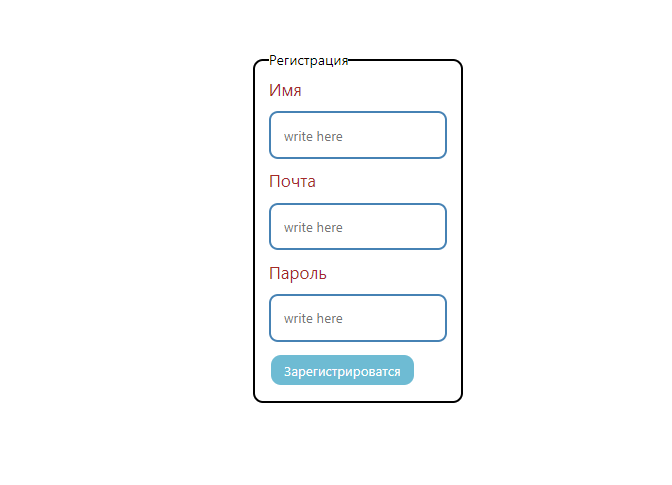
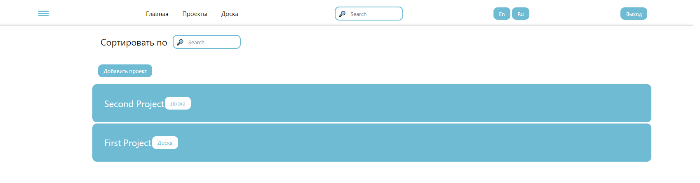
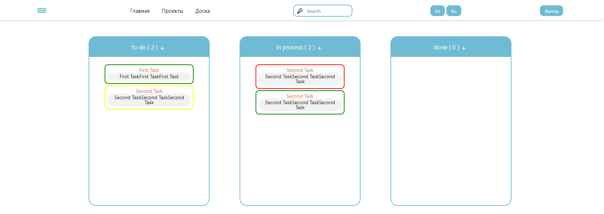

# JiraReact

## Technologies

* Front-End
   * HTML/CSS(SCSS)
   * JS
   * React(HookForm, BeautifulDND, Toastify, i18next)
   * TypeScript
   * AJAX
   * EsLint
   * BEM
* Back-End
   * Node JS
   * MongoDB

## Installation

### Clone the repo

 * git clone https://github.com/vadychka/JiraReact.git
 
### Install NPM packages

* npm i && npm run iDep
* npm run dev 

## Screenshots:

#### Login
  
#### Registration form
 
#### Projects
 
#### Board
 
